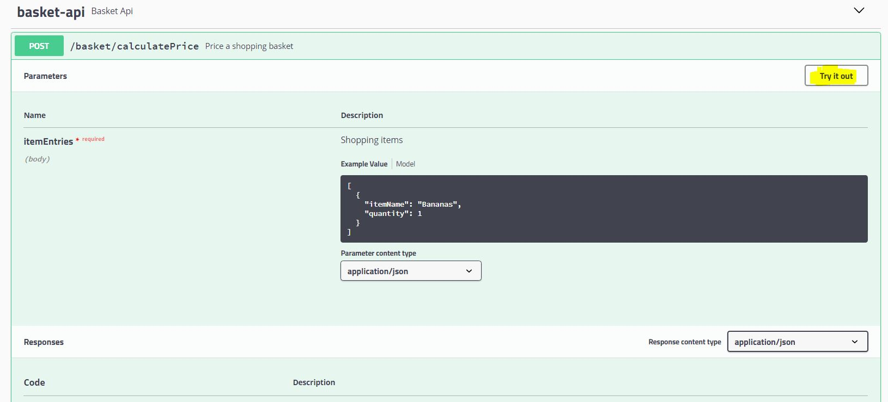

# shopping-basket service

## Specification

Write a java 8 program that takes a basket of items and outputs its total cost.
 - The basket can contain one or more of the following items: Bananas, Oranges, Apples, Lemons, Peaches
 - Please write a java 8 program that takes a basket of items and outputs its total cost.

## Usage

### Run application
Shopping basket service is exposed via REST API and input can be accepted via Swagger GUI. </br>
To run from IDE use ```http://uk.co.mits4u.basket.Application``` main class and goto ```localhost:8080``` in the browser. </br>
To chekout running version use http://shopping-basket-rbc.mits4u.co.uk/
</br>
</br>

